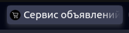
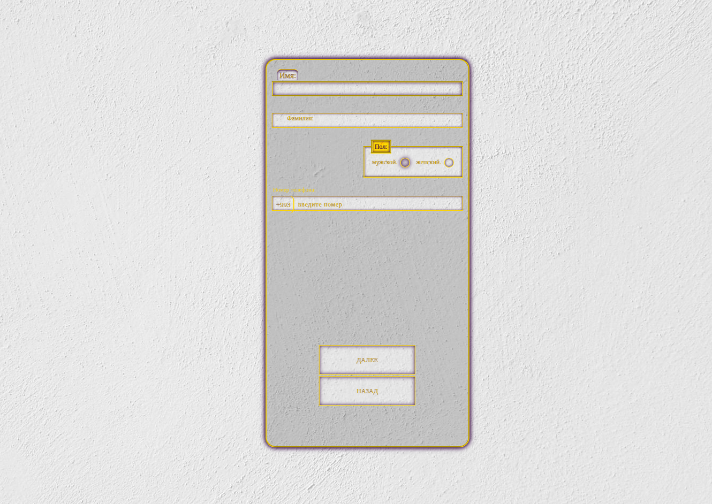

# Just Project


[](LICENSE)

## Description

This project is currently in its early development stage. It includes only initial CSS styling and HTML head metadata. The logic for user authentication and registration is not yet complete and is still under development.

## Current Features

- Initial CSS styling
- HTML head metadata

## Planned Features

- Complete implementation of user authentication and registration logic
- Enhanced styling and UI components
- Integration with a database for storing user data

## Installation

To get started with the project, follow these steps:

1. Clone the repository:

    ```sh
    git clone https://github.com/soulless-ai/just-project-01.git
    cd just-project-01
    ```

2. Open the `index.html` file in your browser:

    ```sh
    open index.html
    ```



## Usage

Once the project is opened in your browser, you can view the current styling and structure. Note that the functionality for authentication and registration is not yet complete and may not work as expected.

## Contribution

We welcome contributions to the project. If you want to help, please create a new branch for your changes and submit a pull request. You can also open an issue to discuss problems and suggestions.

## License

This project is licensed under the MIT License. See the [LICENSE](LICENSE) file for more details.

## Contact

If you have any questions or suggestions, please contact us at telegram: @mrchpk